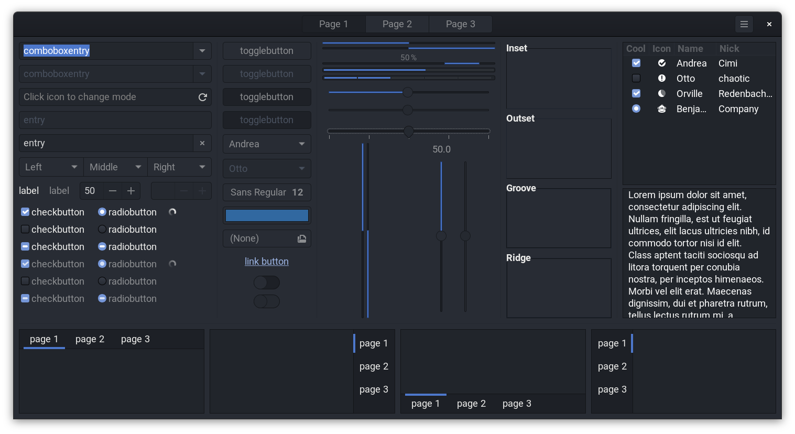

# Adwaita One Dark

[Adwaita](https://github.com/GNOME/gtk/tree/mainline/gtk/theme/Adwaita)(the default theme of GNOME) with the [One Dark color scheme](https://github.com/Binaryify/OneDark-Pro/blob/master/themes/OneDark-Pro.json)

## WIP

- [x] GNOME Shell theme
- [ ] GTK 2 theme
- [x] GTK 3 theme
- [ ] GTK 4 theme
- [ ] GtkSourceView
- [ ] Command line tools for creating other color variants
- [x] Tilix

## How to use

1. Download `Adwaita-One-Dark.zip` from [releases](https://github.com/lonr/adwaita-one-dark/releases) and then unzip `Adwaita-One-Dark` to `~/.local/share/themes`(or `/usr/share/themes`)
2. Install [GNOME Tweaks](https://wiki.gnome.org/Apps/Tweaks) and [User Themes Extension](https://extensions.gnome.org/extension/19/user-themes/)
3. Open Tweaks and change the `Applications` theme and `Shell` theme

## Versions

- If you want to download themes, go to [releases](https://github.com/lonr/adwaita-one-dark/releases). Versions below are just logs
- You can find your GTK 3 and GNOME Shell version via GNOME Tweaks -> "About Tweaks"
  - Or get GNOME Shell version `gnome-shell --version` eg. `3.38.0`
  - Get GTK 3 version `dnf list --installed | grep '^gtk3'` eg. `3.24.23`
- Fedora 34
  - [GNOME Shell 40](https://gitlab.gnome.org/GNOME/gnome-shell/-/tree/gnome-40/data)
  - [GTK 3.24](https://gitlab.gnome.org/GNOME/gtk/-/tree/gtk-3-24/gtk/theme/Adwaita)
  - [libhandy 1.2](https://gitlab.gnome.org/GNOME/libhandy/-/tree/libhandy-1-2/src/themes)
- Fedora 33 Beta
  - [GNOME Shell 3.38.0](https://gitlab.gnome.org/GNOME/gnome-shell/-/tree/3.38.0/data/theme)
  - [GTK 3.24.23](https://gitlab.gnome.org/GNOME/gtk/-/tree/3.24.23/gtk/theme/Adwaita)
  - [libhandy 1.0.0](https://gitlab.gnome.org/GNOME/libhandy/-/tree/1.0.0/src/themes)
- Fedora 32
  - [GNOME Shell 3.36.1](https://gitlab.gnome.org/GNOME/gnome-shell/-/tree/3.36.1/data/theme)
  - [GTK 3.24.18](https://gitlab.gnome.org/GNOME/gtk/-/tree/3.24.18/gtk/theme/Adwaita)

## Thanks to

- [One Dark UI of Atom](https://atom.io/themes/one-dark-ui)
- [One Dark Pro - a wonderful VS Code theme](https://marketplace.visualstudio.com/items?itemName=zhuangtongfa.Material-theme)
- [Ubuntu Yaru theme suite](https://github.com/ubuntu/yaru)
