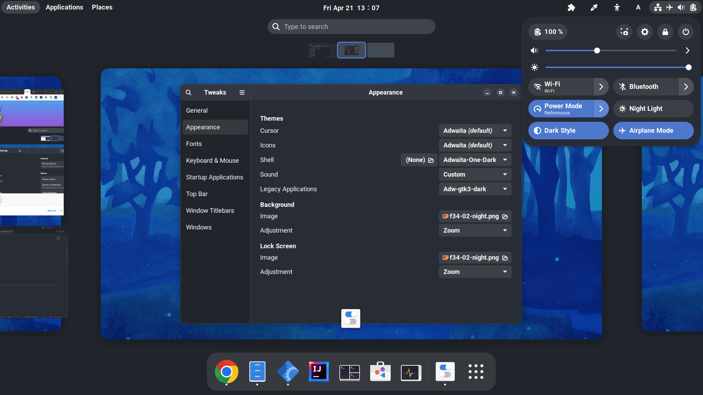
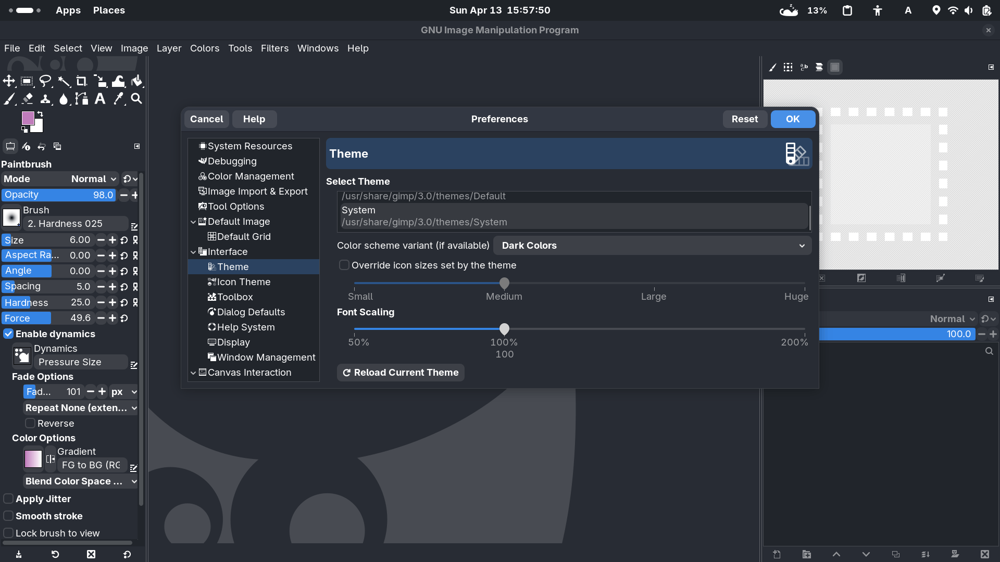

<!-- # Theme Them All

This tool generates themes from provided colors.

## Goals

We prefer to mod existing(usually the official) themes. And we only focus on colors.

> [Theming is actually colors, nothing more.](https://youtu.be/ibT4daaZSTE?t=14)

## One Dark to theme them all

We've generated a set of themes using the One Dark palette. -->

# Adwaita One Dark

[Adwaita](https://gitlab.gnome.org/GNOME/libadwaita/-/tree/main/src/stylesheet)(the default theme of GNOME) with the [One Dark color scheme](https://github.com/Binaryify/OneDark-Pro/blob/master/themes/OneDark-Pro.json)

## Themes available

- [GTK theme](https://github.com/lonr/adwaita-one-dark/releases)
  - [x] GNOME Shell theme
  - [x] GTK 2 theme
  - [x] GTK 3(adw-gtk3-dark) and GTK 4(libadwaita) theme recoloring
  - [ ] GtkSourceView
- Terminals
  - [x] [Tilix](terminals/src/tilix/README.md)
- [ ] Tools for creating other color variants

GNOME Shell Theme:

GTK 2.0(GIMP):

