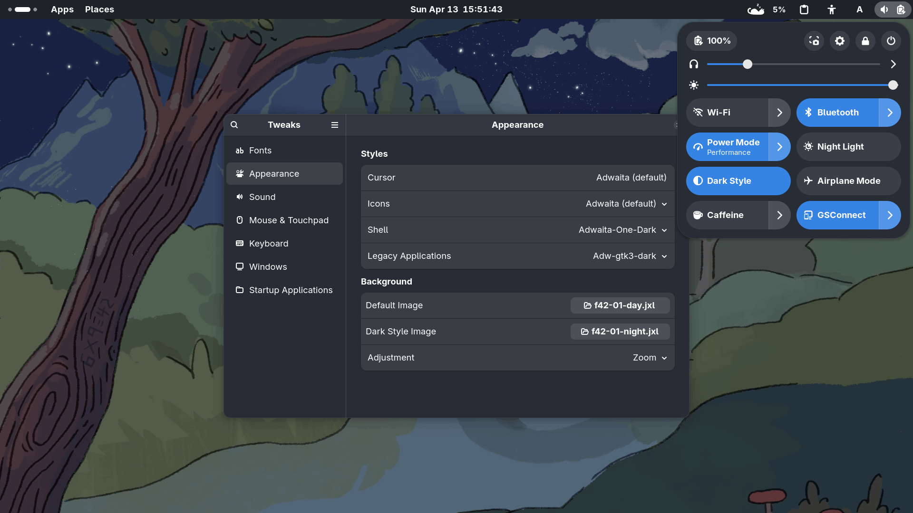

# Adwaita One Dark

[Adwaita](https://gitlab.gnome.org/GNOME/libadwaita/-/tree/main/src/stylesheet)(the default theme of GNOME) with the [One Dark color scheme](https://github.com/Binaryify/OneDark-Pro/blob/master/themes/OneDark-Pro.json)

## Themes available

- [GTK theme](https://github.com/lonr/adwaita-one-dark/releases)
  - [x] GNOME Shell theme
  - [x] GTK 2 theme
  - [x] Recolor GTK 4 (libadwaita) and GTK3 (adw-gtk3-dark)
  - [ ] GtkSourceView
- Terminals
  - [x] [Ptxis](terminals/templates/ptxis/README.md)
  - [x] [Tilix](terminals/templates/tilix/README.md)
  - [x] [Termux](terminals/templates/termux/README.md)
- [ ] Tools for creating other color variants

GNOME Shell Theme:

GTK 3.0(GIMP):

